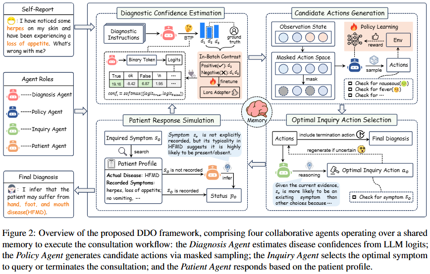

# DDO: Dual-Decision Optimization for LLM-Based Medical Consultation via Multi-Agent Collaboration

<div align="center">

[](https://arxiv.org/abs/2505.18630)
[](https://huggingface.co/zhjia/ddo_checkpoints)
[](mailto:2455512051@qq.com)

</div>

## Introduction
To enable large language models (LLMs) to more effectively perform the two medical consultation subtasks—symptom inquiry and disease diagnosis—we propose the DDO framework. This framework enhances the informativeness of LLM-driven symptom inquiry through LLM-RL collaboration and improves diagnostic accuracy under a limited set of candidate answers via in-batch contrastive learning.



## Environment Setup

```bash
cd DDO/  

pip install -r requirements.txt
```
---


## Training (Optional)

Model training consists of two parts: **LLM Confidence Calibration** and **RL Policy Training**. The cascading training can be time-consuming. If resources are limited, you can directly download and use our pre-trained models for [Inference](#inference).

| Model | 🤗Hugging Face Link |
| --- | --- |
| BTP-Adapter(Qwen2.5-7B-Instruct) | https://huggingface.co/zhjia/DDO/tree/main/adapters |
| BTP-Adapter(Qwen2.5-14B-Instruct) | https://huggingface.co/zhjia/DDO/tree/main/adapters |
| BTP-Adapter(LLama3-8B-Chinese-Chat) | https://huggingface.co/zhjia/DDO/adapters |
| RL Policy Model | https://huggingface.co/zhjia/DDO/tree/main/policy |


### LLM Confidence Calibration

```bash
./run_calibration.sh       # Train the BTP-adapter
```

**Note:** Each diagnostic adapter is evaluated with respect to Top-K accuracy and disease-specific performance.
* For the smallest model, Qwen2.5-7B-Instruct, several well-performing adapters are retained as candidate adapters for RL training.

* For other larger LLMs, a single adapter with the best overall performance is selected for inference.

### RL Policy Training 

```bash
./run_policy_training.sh   # Train the RL policy model
```

**Note:** LLM-RL cascading training can be inherently unstable. To obtain a robust policy that generalizes across different LLM backbones, we follow this procedure:

* Each candidate diagnosis adapter is used to train an RL policy model.
* Among the resulting policy models, the best-performing one is selected as the final Policy Agent, responsible for providing informative actions to different LLM backbones (e.g., Qwen2.5-7B/14B-Instruct, LLaMA3-8B-Chinese-Chat).
---

## Inference

```bash
./run_inference.sh   # run multi-agent workflow
```


